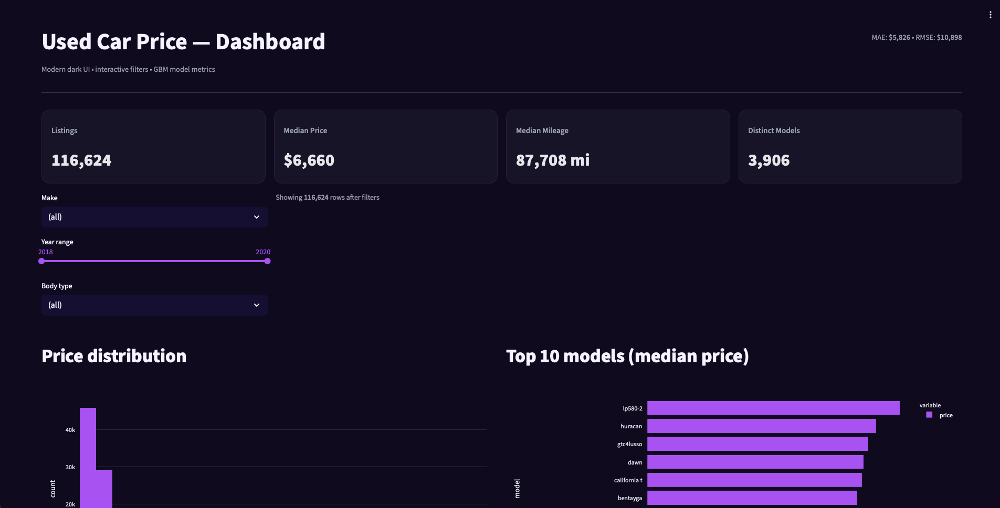

<h1 align="center">Used Car Price — ML & Analytics</h1>

  Predict used-car listing prices and explore market trends with a modern, reproducible pipeline.

  
  
  
  
  
  

> **Dataset:** Kaggle — `tsaustin/us-used-car-sales-data`. Review the dataset’s license on Kaggle before redistribution.

---

## Tech Stack

## Tech Stack

**Data & Modeling**
-   
  pandas • numpy • scikit-learn (pipelines, ColumnTransformer) • **LightGBM** • category-encoders • joblib

**Dev & Tooling**
-   
  Dev Containers • Jupyter

**Planned Delivery**
-  •  •   
  Hosting: Vercel (web), Render (API)

---

## Features

- **Reproducible environment** (`.devcontainer/`) — one-click Codespaces
- **Audit notebook** for schema/missingness sanity checks
- **Robust cleaning** with fuzzy column mapping (e.g., `pricesold → price`, `yearsold → year`)
- **Feature engineering:** `age`, `mileage_per_year`, `high_mileage`
- **Two models:** Ridge (baseline) and **LightGBM** (stronger)
- **Artifacted metrics & previews** (`metrics_*.json`, `preview_gbm.csv`)

---

---
## Quick Links
- ▶️ [Quickstart](#quickstart-codespaces)
- 🧼 [Cleaning & Features](#cleaning--feature-engineering)
- 🤖 [Modeling](#modeling)
- 📈 [Results](#results-current-run)
- 🧪 [Predict Example](#example-predict-with-the-trained-pipeline)
- 🗺️ [Repository Structure](#repository-structure)
- 🖥️ [Dashboard](#dashboard)

---

## Repository Structure

| Path | Description |
|---|---|
| 📁 `.devcontainer/` | Codespaces environment (Python/Node): `devcontainer.json`, `post-create.sh` |
| 📁 `data/` | Raw & processed CSVs *(_gitignored_)* |
| 📁 `model/` | ML assets and scripts |
| ├── `clean_and_preprocess.py` | Cleaning + feature engineering pipeline |
| ├── `preprocessor.pkl` | Fitted `ColumnTransformer` (committed for reuse) |
| ├── `train_baseline.py` | Baseline Ridge trainer (log-price) |
| ├── `train_gbm.py` | LightGBM trainer (stronger model) |
| ├── `metrics_baseline.json` | Baseline metrics (MAE/RMSE/R²) |
| ├── `metrics_gbm.json` | GBM metrics (MAE/RMSE/R²) |
| └── `preview_gbm.csv` | Sample GBM predictions vs. actuals |
| 📁 `notebooks/` | Exploratory notebooks |
| └── `00_quick_audit.ipynb` | Fast schema/missingness audit |
| 📁 `api/` | *(planned)* FastAPI `/predict` service |
| 📁 `web/` | *(planned)* Next.js + Tailwind dashboard |
| 📄 `README.md` | Project documentation |

---

## Results (current run)

| Model     | MAE ($) | RMSE ($) | R²   |
|-----------|---------|----------|------|
| Ridge     | 6,660   | 12,538   | 0.125 |
| LightGBM  | **5,826** | **10,898** | **0.339** |

---
## Data Quality — Make Canonicalization

Cleaning raw **make** values dramatically improves consistency and model signal.  
This project consolidates messy variants (e.g., `bmw 335i`, `mercedes benz`, `volkswagon`, `chevy`, `studabaker`) to clean, branded forms.

**How it works**
- Normalization (case, punctuation, spacing)
- Synonym + misspelling rules (e.g., `vw → Volkswagen`, `chevy → Chevrolet`, `infinity → INFINITI`)
- Two-word brand detection (e.g., `mercedes benz → Mercedes-Benz`, `land rover → Land Rover`)
- Token fallback for title-like strings (e.g., `cadillac only 80k → Cadillac`)

**Artifacts**
- Report: [`model/make_cleaning_report.json`](model/make_cleaning_report.json)  
- Summary table: [`reports/makes_canonical_summary.csv`](reports/makes_canonical_summary.csv)

**Examples (before → after)**

| Raw                         | Canonical        |
|----------------------------|------------------|
| `bmw 335i`                 | **BMW**          |
| `mercedes benz`            | **Mercedes-Benz**|
| `volkswagon`, `vw`         | **Volkswagen**   |
| `chevy`                    | **Chevrolet**    |
| `landrover`, `range rover` | **Land Rover**   |
| `infinity`                 | **INFINITI**     |
| `chrylser`, `crhysler`     | **Chrysler**     |
| `studabaker`               | **Studebaker**   |

---

## Dashboard

  <!-- Replace YOUR_DASHBOARD_URL after you deploy -->
  

  

---

## Model Card (brief)
**Intended use:** Educational/portfolio demo for US used-car price estimation.  
**Data:** Kaggle “US Used Car Sales Data”; columns normalized (e.g., `pricesold→price`, `yearsold→year`).  
**Target:** Price (trained in log-space; predictions returned in USD).  
**Main features:** `year`, `mileage`, `make`, `model`, `body`, `age`, `mileage_per_year`, `high_mileage`.  
**Limitations:** No trim/options, regional demand, or vehicle history → larger error on rare configs.  
**Ethics:** Not for credit/insurance decisions; may reflect historical market biases.

---

## Contributing
PRs welcomed for: API `/predict`, Next.js dashboard, CI, and ONNX export.

## Contact
**Shravan Sulikeri** — feel free to open an issue or reach out via GitHub.

## License
MIT — see `LICENSE`. Verify the Kaggle dataset license before redistributing data/models.

---
